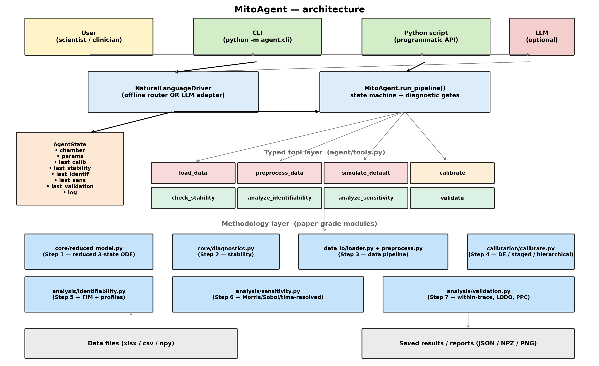

# MitoAgent Research Prototype

MitoAgent is a reproducible research prototype for reduced mechanistic modelling of mitochondrial oxygen consumption rate (OCR) data. It combines deterministic numerical analysis, parameter calibration, identifiability and sensitivity diagnostics, a Streamlit interface, and a rule-constrained scientific interpretation layer.

The prototype helps researchers connect respirometry measurements to an interpretable mathematical model while distinguishing conclusions supported by the available data from parameters or hypotheses that remain uncertain.

> **Status:** MitoAgent is a research prototype. It is not a diagnostic tool, medical device, clinical system, or commercially validated product.


## Live demo

**[Launch the hosted MitoAgent demo](https://mitoagent-research.streamlit.app/)**

The hosted demo can be explored directly in a browser without installing Python or uploading local files.

For the quickest walkthrough:

**Load Data → Use bundled demo data → Demo 1 — Standard OCR workflow → Load dataset**

Then follow the workflow through preprocessing, calibration, numerical diagnostics, identifiability, sensitivity, validation, interpretation, experiment guidance, and report generation.

The hosted application is provided for research and software demonstration purposes only. It does not constitute biological, clinical, commercial, or regulatory validation.




## What the prototype demonstrates

- Loading and parsing Oroboros-style Excel or CSV traces
- Chamber-aware preprocessing and event detection
- Reduced three-state mechanistic simulation
- Deterministic parameter calibration
- Numerical-stability diagnostics
- Fisher-information and profile-likelihood identifiability analysis
- Optional Morris and Sobol sensitivity analysis
- Validation diagnostics and reproducible JSON/CSV outputs
- Cautious hypothesis prioritization and experiment-design guidance
- Deterministic, evidence-constrained interpretation for bundled demo outputs
- No external LLM/provider tool-calling in the approved public release

## Research lineage

MitoAgent builds on the scientific concepts and experimental modelling workflow developed in the earlier MATLAB-based **MitoModel** project:

- **MitoModel:** https://github.com/hypatopia/MitoModel
- **Conference abstract:** https://doi.org/10.1002/alz.090369

MitoModel and MitoAgent are related research artifacts developed at different stages of the founder’s mitochondrial-modelling work.

MitoAgent is not the proposed commercial adaptive digital-twin platform and does not establish commercial, clinical, or regulatory validation.

## Scientific scope and limitations

The model is a reduced OCR-informed representation of Complex-IV-mediated oxygen consumption in an intact respiratory-chain context.

OCR-only data do not uniquely identify the full electron transport chain, protonmotive force, membrane potential, redox state, pH dynamics, disease mechanisms, or isolated Complex IV dysfunction.

Parameter estimates and biological interpretations must be evaluated together with:

- Numerical-stability diagnostics
- Parameter identifiability
- Sensitivity analysis
- Residual diagnostics
- Validation results
- The assumptions and limitations of the reduced model

The bundled files in `data_samples/` and the reference outputs in `results/` are synthetic or representative workflow fixtures. They are included only to demonstrate software execution and support regression testing. They must not be used as biological, clinical, or commercial validation evidence.

## Requirements

- Python 3.10 or later
- A supported operating system capable of running Python, NumPy, SciPy, pandas, and Streamlit

## Installation

### 1. Create a virtual environment

```bash
python -m venv .venv
```

### 2. Activate the environment

On Windows PowerShell:

```powershell
.venv\Scripts\Activate.ps1
```

On Windows Command Prompt:

```bat
.venv\Scripts\activate.bat
```

On macOS or Linux:

```bash
source .venv/bin/activate
```

### 3. Install the core dependencies

```bash
python -m pip install --upgrade pip
python -m pip install -r requirements.txt
```

### Streamlit interface

```bash
python -m pip install -r requirements-ui.txt
streamlit run app/streamlit_app.py
```

### Optional sensitivity analysis

```bash
python -m pip install -r requirements-sensitivity.txt
```

### Development and tests

```bash
python -m pip install -r requirements-dev.txt
pytest -q -m "not slow"
python run_all.py --smoke
```

## Quick demonstration

Run the deterministic workflow using the bundled sample data:

```bash
python -m agent.cli analyze data_samples/dataset_I.xlsx --fast
```

Run the Streamlit interface:

```bash
streamlit run app/streamlit_app.py
```

## Public-demo data boundary

The hosted Streamlit application is **bundled-demo-only**. It accepts only the
synthetic/representative fixtures shipped in `data_samples/`.

**Do not upload private, measured, clinical, proprietary, personally
identifiable, or otherwise restricted data to the hosted/public demo.**

Real/private measured-data analysis for the manuscript is performed only in the
separate private, evidence-gated workflow. The public prototype is not the
canonical manuscript calculation source and its outputs are not manuscript-reportable.

Researchers working from a local clone remain responsible for all data-use
permissions and must keep restricted data outside Git.

## Repository map

```text
agent/          deterministic orchestration and cautious interpretation
analysis/       identifiability, sensitivity, and validation
app/            Streamlit application and UI components
calibration/    deterministic parameter calibration
core/           reduced model, protocols, settings, and diagnostics
data_io/        loading and preprocessing
data_samples/   synthetic/representative demonstration fixtures
results/        synthetic reference outputs used by regression tests
docs/           data and execution guidance
tests/          automated tests
assets/         selected explanatory figures
figures/        reproducible figure-generation scripts
```

## Deterministic interpretation boundary

All numerical simulations, calibrations, parameter estimates, diagnostics,
validation results, and public-demo interpretation are produced by deterministic
Python modules.

External hosted-LLM providers and provider-driven tool calling are **disabled
and excluded from the approved public release**. API-key environment variables
must not activate an external provider.

The public demo is deterministic-only. Its bundled synthetic/demo outputs remain
non-clinical, non-diagnostic, and **not manuscript-reportable**.

## License and permitted use

Copyright © 2026 Marzieh Eini Keleshteri. All rights reserved.

This repository is made publicly available for research transparency, technical evaluation, reproducibility review, and demonstration purposes. No open-source license is granted.

Except for the limited rights provided through GitHub’s Terms of Service, no permission is granted to copy, modify, redistribute, sublicense, commercialize, or incorporate the source code, documentation, figures, or other repository materials into another work without prior written authorization from the copyright holder.

Third-party libraries, software components, and previously licensed materials remain subject to their respective license terms.

This software is provided as a research prototype, without warranties or representations regarding accuracy, fitness for a particular purpose, clinical validity, regulatory compliance, or commercial suitability.

## Contributions

This repository is currently shared for technical evaluation and research transparency.

External pull requests and code contributions are not being accepted at this stage.

Questions, reproducibility observations, and responsible vulnerability reports may be submitted through the repository’s designated contact channel.

## Citation

To cite MitoAgent, use the citation information provided in the repository’s `CITATION.cff` file or select **Cite this repository** in the GitHub sidebar.

When referring to the scientific foundation of the project, please also cite the associated conference abstract:

**Eini Keleshteri, M., et al.** “Advanced Modeling of Bioenergetics in the Mitochondrial Electron Transport Chain with Emphasis on Complex IV.” *Alzheimer’s & Dementia*.  
https://doi.org/10.1002/alz.090369

## Security

Do not report suspected security vulnerabilities through a public GitHub issue.

Please report vulnerabilities privately to the repository maintainer. Do not include real experimental data, credentials, API keys, personal information, or confidential materials in a vulnerability report.

MitoAgent is a research prototype and is not intended for clinical, safety-critical, regulated, or production use.

## Contact

**Maintainer:** Marzieh Eini Keleshteri  
**GitHub:** [@hypatopia](https://github.com/hypatopia)
